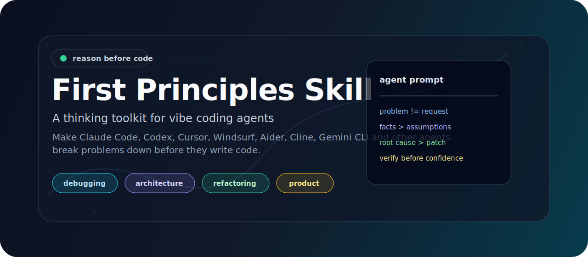
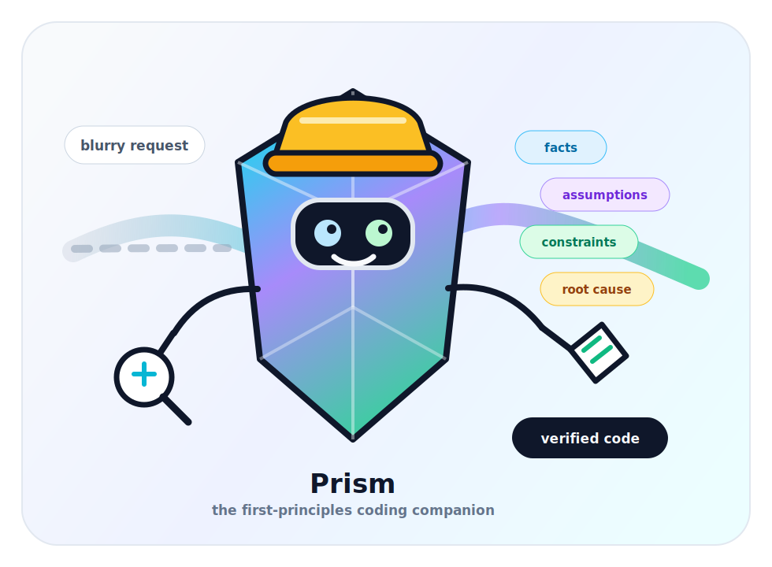
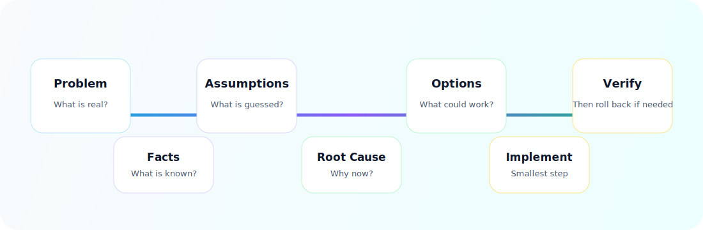

<div align="center">
  

  <h1>First Principles Skill</h1>

  <p>
    <strong>A first-principles thinking toolkit for vibe coding agents.</strong>
    <br>
    Make Claude Code, Codex, Cursor, Windsurf, Aider, Cline, Gemini CLI and other AI coding tools reason from fundamentals before writing code.
  </p>

  <p>
    <a href="README.zh-CN.md">中文</a>
    ·
    <a href="docs/installation.md">Installation</a>
    ·
    <a href="docs/usage.md">Usage</a>
    ·
    <a href="docs/philosophy.md">Philosophy</a>
  </p>

  <p>
    
    
    
    
  </p>
</div>

## The Hot Take

Vibe coding is the new interface. First-principles thinking is the guardrail.

AI coding agents can move incredibly fast, but speed without reasoning often becomes fragile code, unnecessary abstractions, trend-driven architecture, and patches that only hide symptoms.

First Principles Skill gives your agent a lightweight reasoning ritual:

```text
Do not just code the request.
Find the real problem.
Separate facts from assumptions.
Identify constraints and root cause.
Compare options.
Choose the smallest verifiable path.
Then implement.
```

Ship the vibe. Keep the engineering.

## Meet Prism

<p align="center">
  
</p>

Prism is the project's original mascot: a tiny first-principles engineer that turns blurry requests into facts, assumptions, constraints, root causes, options, and verified code.

It exists to make the toolkit memorable. When your agent starts rushing into implementation, Prism is the reminder: split the beam before writing the patch.

Prism and the included visuals are original SVG artwork created for this repository. No stock images, brand marks, celebrity likenesses, or existing character IP are used.

## What This Is

First Principles Skill is a lightweight open-source prompt toolkit for AI coding agents.

It gives developers reusable prompts, project instructions, and integration examples that make coding agents reason before they edit files.

No framework. No dependency. No build step. Just Markdown prompts you can copy into the agent you already use.

## Why It Exists

AI coding tools are great at executing. That is also the danger.

If you ask for the wrong thing, many agents will confidently build the wrong thing. This toolkit helps agents pause just long enough to ask:

- What is the actual problem?
- What do we know for sure?
- What are we assuming?
- Is this the root cause or a symptom?
- Which solution is simplest, reversible, and testable?
- How do we verify the change?
- How do we roll it back?

## How It Works

<p align="center">
  
</p>

The toolkit turns "just implement this" into a small reasoning loop:

| Step | Agent Should Ask | Why It Matters |
| --- | --- | --- |
| Problem | What is the real problem behind the request? | Avoids blindly accepting surface solutions. |
| Facts | What is known from code, logs, tests, docs, or the user? | Keeps reasoning grounded. |
| Assumptions | What are we guessing? | Makes uncertainty visible. |
| Root Cause | Why is this happening? | Prevents symptom patching. |
| Options | What are the viable paths? | Avoids one-shot implementation bias. |
| Implementation | What is the smallest reliable step? | Reduces blast radius. |
| Verification | How do we prove it worked? | Replaces confidence with evidence. |
| Rollback | How do we undo it? | Keeps risky changes reversible. |

## Quick Start

Copy this into your coding agent:

```text
Use first-principles thinking before implementing this.

Identify:
- Problem
- Desired outcome
- Known facts
- Assumptions
- Constraints
- Root cause
- Options
- Tradeoffs
- Recommendation
- Implementation plan
- Verification
- Risks
- Rollback plan

Do not default to accepting my proposed implementation.
Do not start by writing code.
Prefer the smallest reversible and verifiable solution.
```

Or use the full universal prompt:

```text
prompts/first-principles.md
```

## Prompt Pack

| Prompt | Use It For | Core Bias |
| --- | --- | --- |
| [`first-principles.md`](prompts/first-principles.md) | General reasoning before implementation | Reason before code |
| [`first-principles-debugging.md`](prompts/first-principles-debugging.md) | Bugs, regressions, incidents, failing tests | Root cause before patch |
| [`first-principles-architecture.md`](prompts/first-principles-architecture.md) | System design, APIs, services, migrations | Constraints before architecture |
| [`first-principles-refactoring.md`](prompts/first-principles-refactoring.md) | Cleanup, boundaries, technical debt | Complexity source before refactor |
| [`first-principles-product.md`](prompts/first-principles-product.md) | Product scope, feature requests, roadmap calls | User problem before feature pile |

## Agent Integrations

| Tool | Integration | How To Use |
| --- | --- | --- |
| Claude Code | [`integrations/claude-code/.claude/skills/first-principles/SKILL.md`](integrations/claude-code/.claude/skills/first-principles/SKILL.md) | Copy into a Claude Code skill path if your workflow uses skills. Otherwise copy into project instructions. |
| Codex | [`integrations/codex/AGENTS.md`](integrations/codex/AGENTS.md) | Merge into your repository's `AGENTS.md`. |
| Cursor | [`integrations/cursor/cursor-rules.md`](integrations/cursor/cursor-rules.md) | Copy into Cursor Rules or project instructions. |
| Windsurf | [`integrations/windsurf/windsurf-rules.md`](integrations/windsurf/windsurf-rules.md) | Copy into Windsurf rules, custom instructions, or project instructions. |
| Aider, Cline, Gemini CLI, others | [`prompts/first-principles.md`](prompts/first-principles.md) | Paste into the agent's reusable prompt, custom instructions, or task preface. |

This repository avoids invented platform commands. If a tool's configuration flow changes, copy the relevant prompt into that tool's current project rules or custom instruction mechanism.

## Where This Helps

| Scenario | What Usually Goes Wrong | First-Principles Move |
| --- | --- | --- |
| Debugging | Agent patches the first error message. | Reproduce, isolate candidates, prove root cause. |
| Architecture | Agent reaches for fashionable infrastructure. | Start from constraints, data flow, failure modes, team capacity. |
| Refactoring | Agent moves code without reducing complexity. | Find the true complexity source, preserve behavior. |
| Technical decisions | Agent picks the popular tool. | Compare fit, cost, reversibility, verification. |
| Product thinking | Agent turns every request into a feature. | Start from user problem, value chain, evidence, smallest experiment. |

## Example Prompts

Practical examples live in [`examples/`](examples/):

- [`debugging.md`](examples/debugging.md)
- [`architecture.md`](examples/architecture.md)
- [`refactoring.md`](examples/refactoring.md)
- [`technical-decision.md`](examples/technical-decision.md)
- [`product-thinking.md`](examples/product-thinking.md)

## When To Use It

Use it when the task has ambiguity, risk, or multiple possible paths:

- Root-cause debugging
- Architecture design
- Refactoring strategy
- Technical selection
- Product and scope decisions
- Performance work
- Reliability improvements
- Security-sensitive changes
- Migration planning

For tiny, obvious edits, keep the reasoning short. The point is discipline, not ceremony.

## File Structure

```text
README.md
README.zh-CN.md
LICENSE
CHANGELOG.md
CONTRIBUTING.md
.gitignore
assets/
  hero.svg
  reasoning-loop.svg
  foundation.svg
  prism-mascot.svg
prompts/
  first-principles.md
  first-principles-debugging.md
  first-principles-architecture.md
  first-principles-refactoring.md
  first-principles-product.md
integrations/
  claude-code/
    .claude/skills/first-principles/SKILL.md
  codex/
    AGENTS.md
  cursor/
    cursor-rules.md
  windsurf/
    windsurf-rules.md
examples/
  debugging.md
  architecture.md
  refactoring.md
  technical-decision.md
  product-thinking.md
docs/
  installation.md
  usage.md
  philosophy.md
```

## Safety And Privacy

This repository contains only text prompts, docs, and lightweight SVG assets. It does not require API keys, telemetry, package installation, or runtime network access.

When contributing, do not commit:

- API keys, tokens, cookies, or credentials.
- Private SSH keys or local certificates.
- Local absolute paths or machine-specific configuration.
- IDE caches, logs, temporary files, or generated binaries.
- Private project details copied from proprietary codebases.

## Contributing

Contributions are welcome. Keep the toolkit lightweight, vendor-neutral, and practical.

Before opening a pull request:

- Keep prompts clear and reusable.
- Avoid platform-specific claims unless verified.
- Do not add dependencies unless there is a strong reason.
- Include examples when adding a new workflow.
- Run a quick scan for secrets and local machine details.

See [`CONTRIBUTING.md`](CONTRIBUTING.md) for more.

## License

MIT License. See [`LICENSE`](LICENSE).
